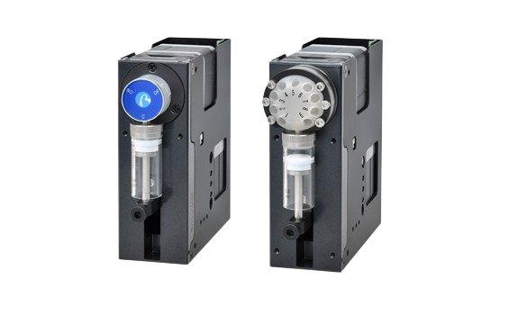

<p align="center">
  
</p>

python serial interfaces to various devices by Runze Fluid and Aurora Pro Scientific.

## Supported Devices and Interfaces:
| Device    | Description               | Runze Protocol | ASCII Protocol | OEM Protocol | Webpage                                                                               |
|-----------|---------------------------|----------------|----------------|--------------|---------------------------------------------------------------------------------------|
| SY08      | syringe pump              | yes            | no             | no           | [SY08](https://www.runzefluid.com/products/Syringe%20Pump-sy-08.html)                 |
| Mini-SY04 | syringe pump              | yes            | no             | no           | [Mini-SY04](https://www.runzefluid.com/products/programmable-syringe-pump.html)       |
| ZSB-SY01B | multichannel syringe pump | yes            | no             | no           | [ZSB-SY01B](https://www.runzefluid.com/products/multi-channel-syringe-pump.html)      |
|           |                           |                |                |              |                                                                                       |

More devices to come!

## Installation

To install this package directly from Github without downloading a local copy of the repository: 
```bash
 pip install "git+https://github.com/allenneuraldynamics/runze-control@main"
```

To install this package from a local download, clone the repository. Then, from this directory, invoke:
```bash
pip install .
```
or (editable mode)
```bash
pip install -e .
```

Finally, to install this package in editable mode and build the docs locally, invoke:
```bash
pip install -e .[dev]
```


## Getting Started
```python
from runze_control.syringe_pump import SY01B
```
Create an instance with:
```python
syringe_pump = SY01B("COM3") # Create a device instance with unknown baudrate.
                             # (The package will try all compatible baudrates.)
```

The factory default device address is set to 0x00, but it's possible to change the address with either a software command or a physical rotary switch present on some devices.
If the device's address has been set to a different address, you can specify it with:
```python
syringe_pump = SY01B("COM3", address=0x01) # Create a device instance with
                                           # an unknown baudrate and
                                           # address 0x01.
```

> [!WARNING]
> If you have multiple devices connected to the same bus on an RS485 connection,
> addresses _must_ be distinct and you _must_ specify the address.

From here, various commands exist such as:
````python
syringe_pump.move_valve_to_position(1)  # Select valve position 1.
syringe_pump.withdraw(1000)  # Withdraw 1000[uL] from the current position.
syringe_pump.move_valve_to_position(10)  # Select valve position 10.
syringe_pump.dispense(1000)  # Dispense 1000[uL] to the current position.
````

A host of other commands exist to provision the syringe pump (and all other devices) with default power-up settings.
See the [examples folder](./examples) for more examples.

## Changing Communication Protocol
As written, this package only supports devices using _Runze_ Protocol, not _ASCII_ protocol (also referred to as _DT_ protocol in the device documentation.
But this package provides utility functions to change the communication protocol from _DT_ to _Runze_ (and back again!).
```python
from runze_control.runze_device import get_protocol, set_protocol
from runze_control.protocol import Protocol

COM_PORT = "/dev/ttySB0" # Or COMx on Windows.

curr_protocol = get_protocol(COM_PORT, 9600))
print(curr_protocol)

set_protocol(COM_PORT, 9600, Protocol.RUNZE)) # Change device to Runze Protocol
                                              # (requires a powercycle to take effect)
```


## Logging
All hardware transactions are logged via an instance-level logger.
No handlers are attached, but you can display them with this boilerplate code:
````python
import logging

# Send log messages to stdout so we can see every outgoing/incoming msg.
# Only display messages from this package.
class LogFilter(logging.Filter):
    def filter(self, record):
        return record.name.split(".")[0].lower() in ['runze_control']

fmt = '%(asctime)s.%(msecs)03d %(levelname)s %(name)s: %(message)s'
logger = logging.getLogger()
logger.setLevel(logging.DEBUG)
logger.addHandler(logging.StreamHandler())
logger.handlers[-1].setFormatter(logging.Formatter(fmt=fmt))
logger.handlers[-1].addFilter(LogFilter())

# Now, create a device instance as usual and issue some commands to it.
````
